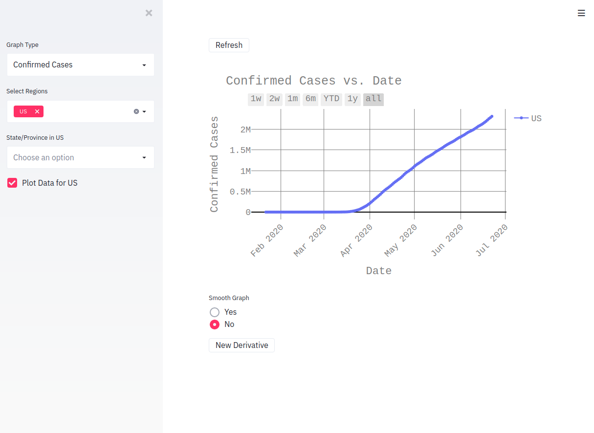

# covid19_data_analysis
script for parsing and plotting data from Johns Hopkins COVID-19 data repository

https://github.com/CSSEGISandData/COVID-19

This script allows users to plot many different graphs relating to COVID-19 data:
* Confirmed Cases vs. Date
* Recovered Cases vs. Date
* Active Cases vs. Date
* Deaths vs. Date
* Daily Cases per 1mil Population vs. Date (Incident Rate)
* Daily Rate of Confirmed Cases to People Tested vs. Date
* Total People Tested vs. Date
* Death Rate vs. Date

This project was built using python3 with the help of streamlit and curl (to automatically grab data)

## Install

Clone repository and run ```pip install -r requirements.txt```. This will install all python dependencies

Other dependencies include ```curl```

## Usage

Run ```python covid19_data_analysis.py``` or ```python3 covid19_data_analysis.py``` depending on os for the old version that utilizes a cli (the only working plot is confirmed cases when utilizing this version and it only has US data)

For the new version use ```streamlit run webserver.py``` and a webserver will start running at ```localhost:8501```

## Sample Output 

<p style="border-width: 2px; border-color: black; border-style:solid;" align="center">
  
  Graph of Confirmed Cases vs. Date of US using new UI
</p>


## License
[gpl-3.0](https://opensource.org/licenses/lgpl-3.0.html)

## Project Status
In development with daily to weekly commits

## Features coming soon
* Better error handling
* Portability Testing
* More Types of Graphs 
* Descriptions of what each graph shows
* Ability to read data directly from github instead of having to save it to disk
