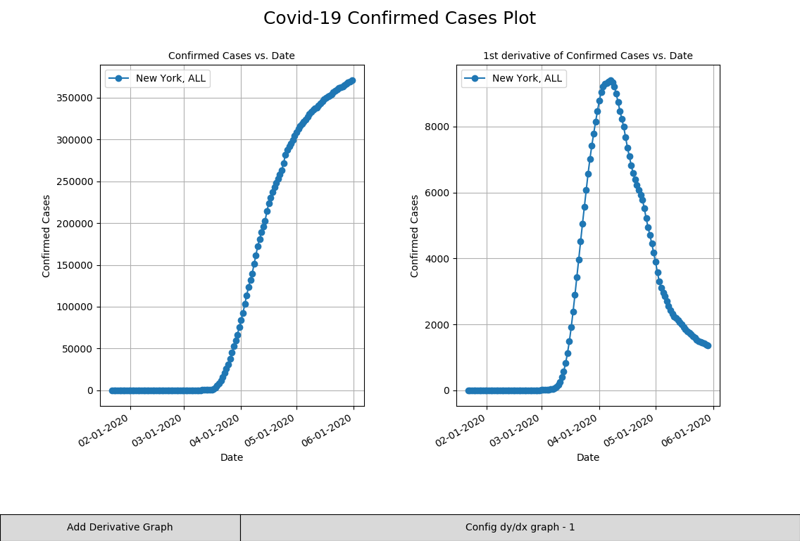
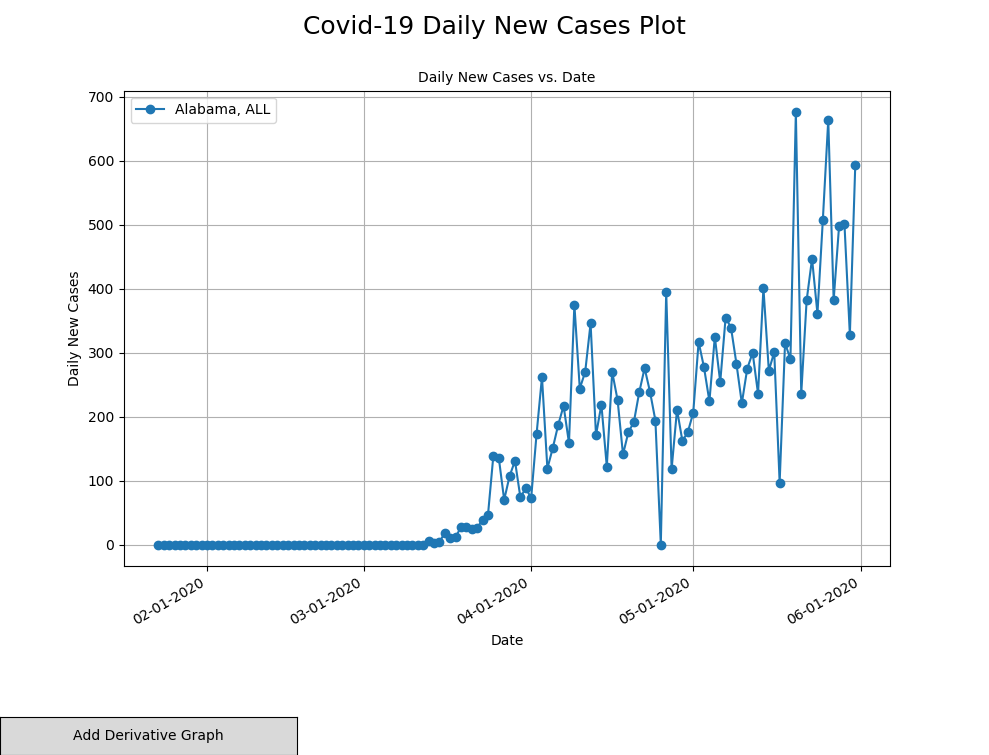
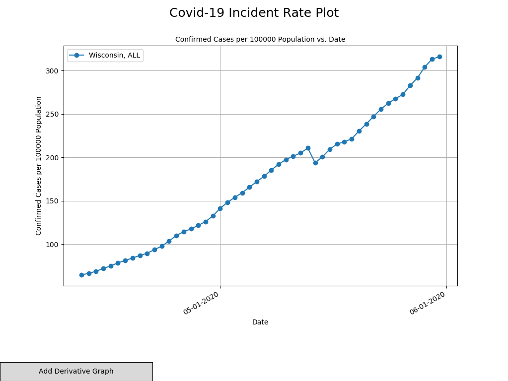
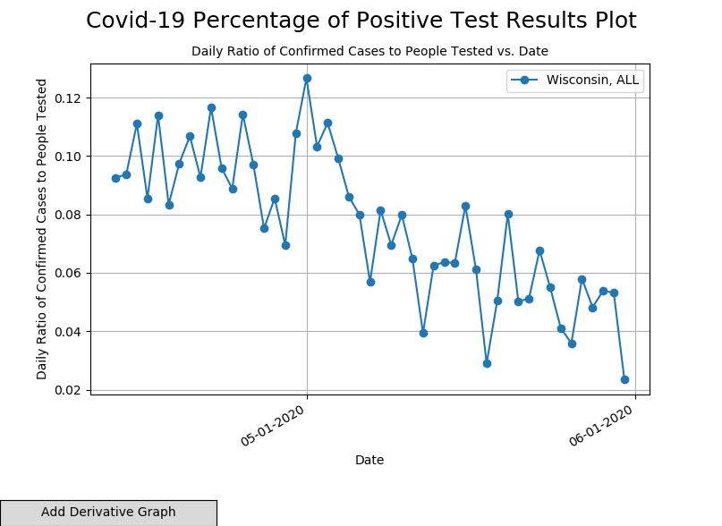
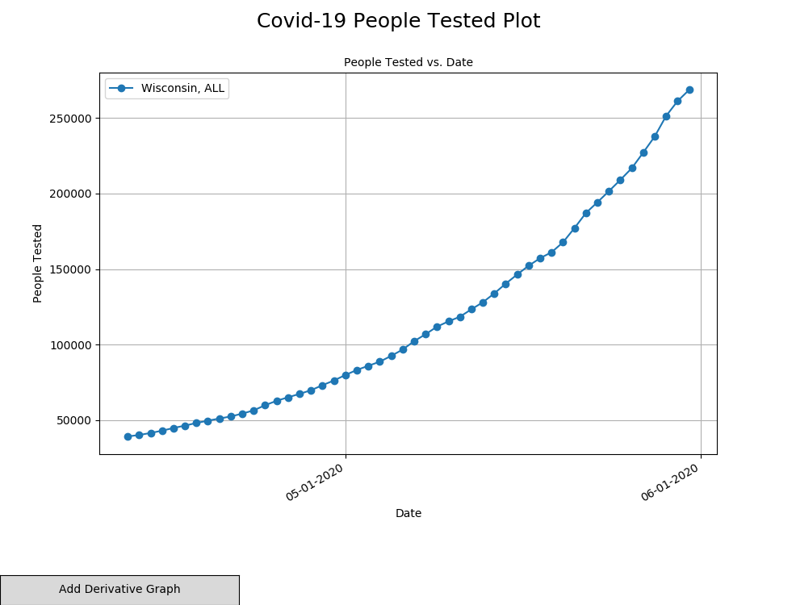
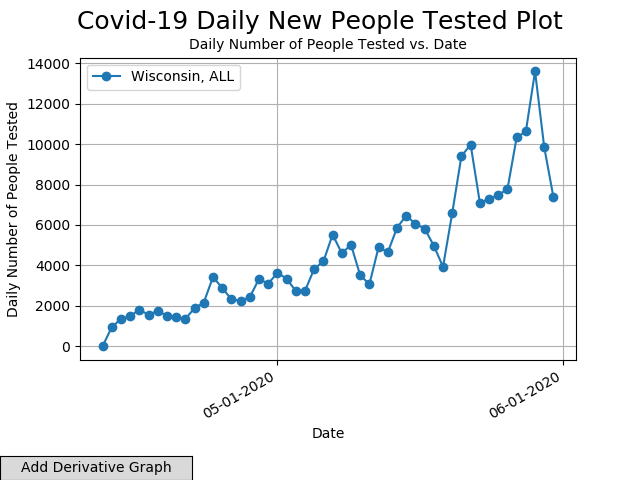

# covid19_data_analysis
script for parsing and plotting data from Johns Hopkins COVID-19 data repository

https://github.com/CSSEGISandData/COVID-19

This script allows users to plot many different graphs relating to COVID-19 data:
* Confirmed Cases vs. Date
* Daily Cases per 1mil Population vs. Date
* Daily Number of People Tested vs. Date
* Daily Rate of Confirmed Cases to People Tested vs. Date
* New Cases vs. Date
* Total People Tested vs. Date

This project was built using python3 and curl (to automatically grab data)

## Install

Clone repository and run ```pip install -r requirements.txt```. This will install all python dependencies

Other dependencies include ```curl```

## Usage

Run ```python covid19_data_analysis.py``` or ```python3 covid19_data_analysis.py``` depending on os

## Sample Output 

<style>
#border {border-width: 10px;}
</style>

<p style="border-width: 2px; border-color: black; border-style:solid;" align="center">
  
  Graph of Confirmed Cases vs. Date and its Derivative
</p>

<p style="border-width: 2px; border-color: black; border-style:solid;" align="center">
  
  Graph of Daily New Cases vs. Date
</p>

<p style="border-width: 2px; border-color: black; border-style:solid;" align="center">
  
  Graph of Confirmed Cases per 1,000,000 people vs. Date

<p style="border-width: 2px; border-color: black; border-style:solid;" align="center">
  
  Graph of Confirmed Cases to People Tested vs. Date
</p>

<p style="border-width: 2px; border-color: black; border-style:solid;" align="center">
  
  Graph of People Tested vs. Date
</p>

<p style="border-width: 2px; border-color: black; border-style:solid;" align="center">
  
  Graph of New People Tested vs. Date
</p>


## License
[gpl-3.0](https://opensource.org/licenses/lgpl-3.0.html)

## Project Status
In development with daily to weekly commits

## Features coming soon
* Better error handling
* Easier UI
* Increased Portability
* Portability Testing
* Plots of Deaths vs. Date 
* Plots for countries other than the USA
* Smoothing on original plot, not just on derivative plots
